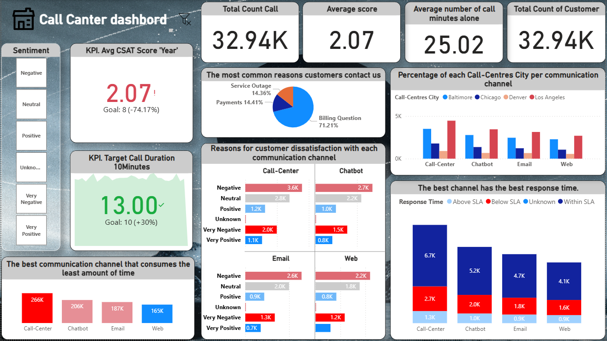
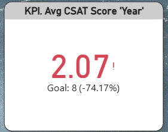
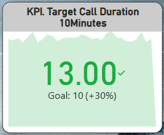
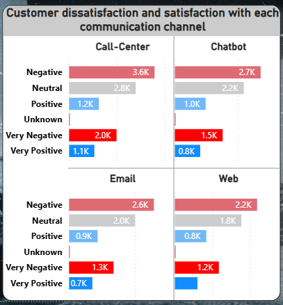
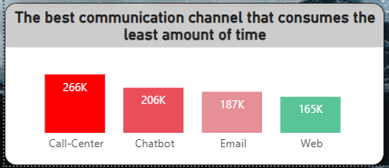
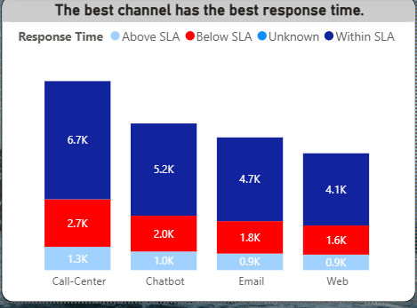

# Call-Canter-Dashbord-Power-Bi
Interactive Power BI dashboard for Call Center performance analysis. Tracks CSAT, call duration, response time, sentiment, and channel efficiency.

لوحة تحكم تفاعلية مبنية بـ *Power BI* لتحليل أداء مركز الاتصال (Call Center).

## المميزات الرئيسية
- متوسط رضا العملاء (CSAT Score)
- متوسط وإجمالي مدة المكالمات
- وقت الاستجابة (Response Time)
- تحليل المشاعر (Sentiment: Positive / Negative / Neutral ...)
- أكثر أسباب المكالمات شيوعًا
- مقارنة بين قنوات التواصل (Phone, Email, Chatbot, Web ...)

## الداشبورد الرئيسي

### الصفحة الرئيسية (Home Page)

### متوسط درجة رضا العملاء (Avg CSAT Score - Year)

### متوسط مدة المكالمة (Avg Call Duration)

### رضا العملاء وعدم الرضا حسب قنوات التواصل

### أقل قناة تستهلك وقت

### أفضل قناة من حيث وقت الاستجابة (Response Time)

## كيفية استخدام المشروع
1. قم بتنزيل ملف الـ *.pbix* من الريبو
2. افتح الملف باستخدام *Power BI Desktop*
3. إذا لم تظهر البيانات → غيّر مسار مصدر البيانات من داخل Power BI (Get Data → Edit Queries)

## الملفات المهمة
- Call Center Dashboard.pbix ← الملف الرئيسي للتقرير
-  لقطات شاشة للصفحات المختلفة مثل: 
main-dashboard, response-time, dissatisfaction-and-satisfaction, KPI-Avg-Call-Duration, KPI-Avg-CSAT-Score-Year, Less-time-consumption

## ملاحظات
- البيانات المستخدمة وهمية / anonymized
- تم بناء الـ dashboard باستخدام DAX measures و visuals متنوعة (KPI, Cards, Bar charts,  ...)

جزء من بورتفوليو خاص بي 
